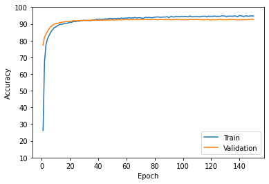

# dogbreed

# Application part 
This project predicts  the breed from 173 defferent breeds

### Stack:

HTML - CSS - Js - Jquey - Bootstrap - Chart.js - Flask - Python 

### Icon Set: 
[Fontawesome](https://www.Fontawesome.com)

### Source of Images: 
[Unsplash](https://unsplash.com/)

# AI part 

## Dataset:

Combination of 3 datasets:

- [Dog Breed Identification](https://www.kaggle.com/c/dog-breed-identification/data)

- [Dog Breed Classification](https://www.kaggle.com/venktesh/person-images)

- [Dog Breed Prediction Competition](https://www.kaggle.com/malhotra1432/dog-breed-prediction-competition)

## Epoch1:
 
## Epoch2:
 
## Epoch3:
 
## Epoch4:
 
## Epoch5:
 

