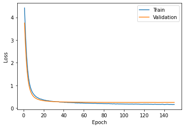

# Dog Breed Classification

This project predicts  the breed from 173 defferent breeds.

<ins>[LIVE DEMO]()</ins>&nbsp;&nbsp;&nbsp;<ins>[GIF(Computer Browser)](#computer-browser-demo)</ins>&nbsp;&nbsp;&nbsp;
<ins>[GIF(Mobile Browser)](#mobile-browser-demo)</ins>&nbsp;&nbsp;&nbsp;
<ins>[Web Application Section](#web-application-section)</ins>&nbsp;&nbsp;&nbsp;
<ins>[AI Section](#ai-section)</ins>
&nbsp;&nbsp;&nbsp;
### Computer Browser Demo: 

### Mobile Browser Demo:

# Web Application Section 
  
### Stack:

HTML - CSS - Js - Jquey - Bootstrap - Chart.js - Flask - Python 

### Icon Set:
[Fontawesome](https://www.Fontawesome.com)

### Source of Images: 
[Unsplash](https://unsplash.com/)

# AI Section: 

### Dataset:

Combination of 3 datasets:

- [Dog Breed Identification](https://www.kaggle.com/c/dog-breed-identification/data)

- [Dog Breed Classification](https://www.kaggle.com/venktesh/person-images)

- [Dog Breed Prediction Competition](https://www.kaggle.com/malhotra1432/dog-breed-prediction-competition)

### Model:
- Using 3 pretrained models ( Inception_V3, Resnext50, Resnet50 )

- Feed the image into models seperately and get the the last Conv features

- Stack these features toghether

- Feed that to a two layer classifier

### Details of Implementation:
- #### Genreralization: 
   - Drop out (Classifier) + Weight Decay + 5 Fold Cross-Validation
- #### Learning rate: 
   - 0.0001
- #### Train / Valid Split: 
   - Approximately : 0.8 Train | 0.2 Validation  
- #### Tools: 
   - Python - Pytorch 

### 5 Fold Cross-Validation:

- ### Fold1:
  - ##### Loss & Accuracy (60 Epochs):
          - Best Validation Loss : 0.2975
          - (In Epoch 59 | Accuracy : 91.12 %) [This model is selected]

 
- ### Fold2:
  - ##### Loss & Accuracy (60 Epochs):
          - Best Validation Loss : 0.3014
          - (In Epoch 49 | Accuracy : 90.74 %) [This model is selected]  

 
- ### Fold3:
  - ##### Loss & Accuracy (60 Epochs):
          - Best Validation Loss : 0.3360
          - (In Epoch 44 | Accuracy : 90.29 %) [This model is selected]

 
- ### Fold4:
  - ##### Loss & Accuracy (60 Epochs):
          - Best Validation Loss : 0.3574
          - (In Epoch 55 | Accuracy : 90.60 %) [This model is selected]

 
- ### Fold5:
  - ##### Loss & Accuracy (60 Epochs):
          - Best Validation Loss : 0.3220
          - (In Epoch 53 | Accuracy : 90.12 %) [This model is selected]

 

