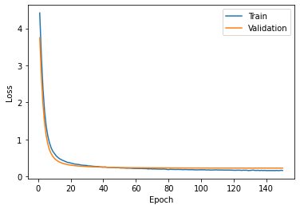
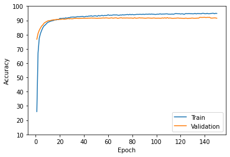

# Dog Breed Classification

This project predicts  the breed from 150 defferent breeds.

<ins>[LIVE DEMO]()</ins>&nbsp;&nbsp;&nbsp;<ins>[GIF(Computer Browser)](#computer-browser-demo)</ins>&nbsp;&nbsp;&nbsp;
<ins>[GIF(Mobile Browser)](#mobile-browser-demo)</ins>&nbsp;&nbsp;&nbsp;
<ins>[Web Application Section](#web-application-section)</ins>&nbsp;&nbsp;&nbsp;
<ins>[AI Section](#ai-section)</ins>
&nbsp;&nbsp;&nbsp;
### Computer Browser Demo: 

### Mobile Browser Demo:

# Web Application Section 
  
### Stack:

HTML - CSS - Js - Jquey - Bootstrap - Chart.js - Flask - Python 

### Icon Set:
[Fontawesome](https://www.Fontawesome.com)

### Source of Images: 
[Unsplash](https://unsplash.com/)

# AI Section: 

### Dataset:

Combination of 3 datasets:

- [Stanford Dogs Dataset](http://vision.stanford.edu/aditya86/ImageNetDogs/)

- [Dog Breed Classification](https://www.kaggle.com/venktesh/person-images)

- [Dog Breed Prediction Competition](https://www.kaggle.com/malhotra1432/dog-breed-prediction-competition)

Number of total images:
- 22790

### Model:
- Using [EfficientNet-B3](https://arxiv.org/abs/1905.11946) model ( pretrained )

- Feed the image into the model and save the last Conv features

- Feed that to a one layer classifier ( just train the classifier )

### Details of Implementation:
- #### Genreralization: 
   - Drop out (0.8) \[in classifier\] + 5 Fold Cross-Validation
- #### Dropout: 
   - 0.8
- #### Batch size (Train): 
   - 25 
- #### Learning rate: 
   - 0.0001
- #### Optimizer: 
   - ADAM
- #### Train-Validation vs Test Split: 
   - Approximately : 0.8 | 0.2 
- #### Train vs Validation Split: 
   - Approximately : 0.8 | 0.2 
- #### Tools: 
   - Python - Pytorch ( Using Google Colab Pro )
- #### Processing: 
   - Resize (H = 400, W = 350) | Rotate | Normalize
- #### Test Result: 
   - loss : 0.2230  | Accuracy: 92.87 

### 5 Fold Cross-Validation:

- ### Fold1:
  - ##### Loss & Accuracy (150 Epochs):
          - Best Validation Loss : 0.2477
          - (In Epoch 134 | Accuracy : 92.60 %) [This model is selected]
          - Test Accuracy on this model : 92.48 %

 
- ### Fold2:
  - ##### Loss & Accuracy (150 Epochs):
          - Best Validation Loss : 0.2262
          - (In Epoch 147 | Accuracy : 92.39 %) [This model is selected]  
          - Test Accuracy on this model : 92.68 %
 
- ### Fold3:
  - ##### Loss & Accuracy (150 Epochs):
          - Best Validation Loss : 0.2489
          - (In Epoch 111 | Accuracy : 91.86 %) [This model is selected]
          - Test Accuracy on this model : 92.39 %
 
- ### Fold4:
  - ##### Loss & Accuracy (150 Epochs):
          - Best Validation Loss : 0.2630
          - (In Epoch 134 | Accuracy : 91.59 %) [This model is selected]
          - Test Accuracy on this model : 92.46 %
 
- ### Fold5:
  - ##### Loss & Accuracy (150 Epochs):
          - Best Validation Loss : 0.2425
          - (In Epoch 135 | Accuracy : 92.46 %) [This model is selected]
          - Test Accuracy on this model : 92.33 %
 

