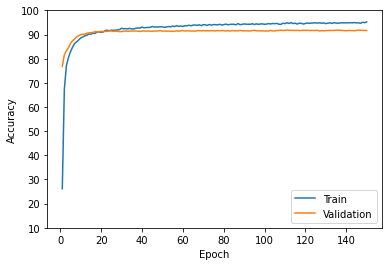

# Dog Breed Classification

This project predicts  the breed from 173 defferent breeds.

<ins>[LIVE DEMO]()</ins>&nbsp;&nbsp;&nbsp;<ins>[GIF(Computer Browser)](#computer-browser-demo)</ins>&nbsp;&nbsp;&nbsp;
<ins>[GIF(Mobile Browser)](#mobile-browser-demo)</ins>&nbsp;&nbsp;&nbsp;
<ins>[Web Application Section](#web-application-section)</ins>&nbsp;&nbsp;&nbsp;
<ins>[AI Section](#ai-section)</ins>
&nbsp;&nbsp;&nbsp;
### Computer Browser Demo: 

### Mobile Browser Demo:

# Web Application Section 
  
### Stack:

HTML - CSS - Js - Jquey - Bootstrap - Chart.js - Flask - Python 

### Icon Set:
[Fontawesome](https://www.Fontawesome.com)

### Source of Images: 
[Unsplash](https://unsplash.com/)

# AI Section: 

### Dataset:

Combination of 3 datasets:

- [Stanford Dogs Dataset](http://vision.stanford.edu/aditya86/ImageNetDogs/)

- [Dog Breed Classification](https://www.kaggle.com/venktesh/person-images)

- [Dog Breed Prediction Competition](https://www.kaggle.com/malhotra1432/dog-breed-prediction-competition)

Number of total images:
- 22870

### Model:
- Using 3 pretrained models ( Inception_V3, Resnext101, Resnet152 )

- Feed the image into models seperately and get the the last Conv features

- Stack these features toghether -> (2048 + 2048 + 2048)

- Feed that to a one layer classifier (just train the classifier)

### Details of Implementation:
- #### Genreralization: 
   - Drop out (Classifier) + Weight Decay + 5 Fold Cross-Validation
- #### Dropout: 
   - 0.8
- #### Weight Decay: 
   - 1e-4
- #### Learning rate: 
   - 0.0001
- #### Optimizer: 
   - ADAM
- #### Train / Test Split: 
   - Approximately : 0.8 | 0.2 
- #### Tools: 
   - Python - Pytorch (Using Google Colab Pro)
- #### Processing: 
   - Resize (h=400, w=300)| Rotate | Noramlize
- #### Test Result: 
   - loss : 0.2230  | Accuracy: 92.87 

### 5 Fold Cross-Validation:

- ### Fold1:
  - ##### Loss & Accuracy (80 Epochs):
          - Best Validation Loss : 0.2621
          - (In Epoch 65 | Accuracy : 91.64 %) [This model is selected]
          - Test Accuracy on this model : 92.40 %

 
- ### Fold2:
  - ##### Loss & Accuracy (80 Epochs):
          - Best Validation Loss : 0.2361
          - (In Epoch 58 | Accuracy : 91.89 %) [This model is selected]  
          - Test Accuracy on this model : 92.27 %
 
- ### Fold3:
  - ##### Loss & Accuracy (80 Epochs):
          - Best Validation Loss : 0.2593
          - (In Epoch 73 | Accuracy : 91.33 %) [This model is selected]
          - Test Accuracy on this model : 92.36 %
 
- ### Fold4:
  - ##### Loss & Accuracy (80 Epochs):
          - Best Validation Loss : 0.2584
          - (In Epoch 50 | Accuracy : 91.73 %) [This model is selected]
          - Test Accuracy on this model : 92.45 %
 
- ### Fold5:
  - ##### Loss & Accuracy (80 Epochs):
          - Best Validation Loss : 0.2425
          - (In Epoch 70 | Accuracy : 92.68 %) [This model is selected]
          - Test Accuracy on this model : 92.40 %
 

