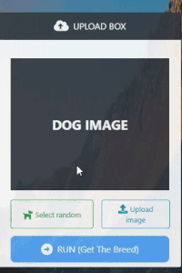

# dogbreed

<ins>[LIVE DEMO]() </ins>&nbsp;&nbsp;&nbsp;<ins>[GIF(Computer Browser)](#computer-browser-demo)</ins>&nbsp;&nbsp;&nbsp;
<ins>[GIF(Mobile Browser)](#mobile-browser-demo)</ins>&nbsp;&nbsp;&nbsp;
<ins>[Application part](#application-section)</ins>&nbsp;&nbsp;&nbsp;
<ins>[AI part](#ai-section)</ins>
&nbsp;&nbsp;&nbsp;
### Computer Browser Demo: 

### Mobile Browser Demo:

# Application Section 
This project predicts  the breed from 173 defferent breeds
  
### Stack:

HTML - CSS - Js - Jquey - Bootstrap - Chart.js - Flask - Python 

### Icon Set:
[Fontawesome](https://www.Fontawesome.com)

### Source of Images: 
[Unsplash](https://unsplash.com/)

# AI Section: 

### Dataset:

Combination of 3 datasets:

- [Dog Breed Identification](https://www.kaggle.com/c/dog-breed-identification/data)

- [Dog Breed Classification](https://www.kaggle.com/venktesh/person-images)

- [Dog Breed Prediction Competition](https://www.kaggle.com/malhotra1432/dog-breed-prediction-competition)

### Fold1:
 
### Fold2:
 
### Fold3:
 
### Fold4:
 
### Fold5:
 

